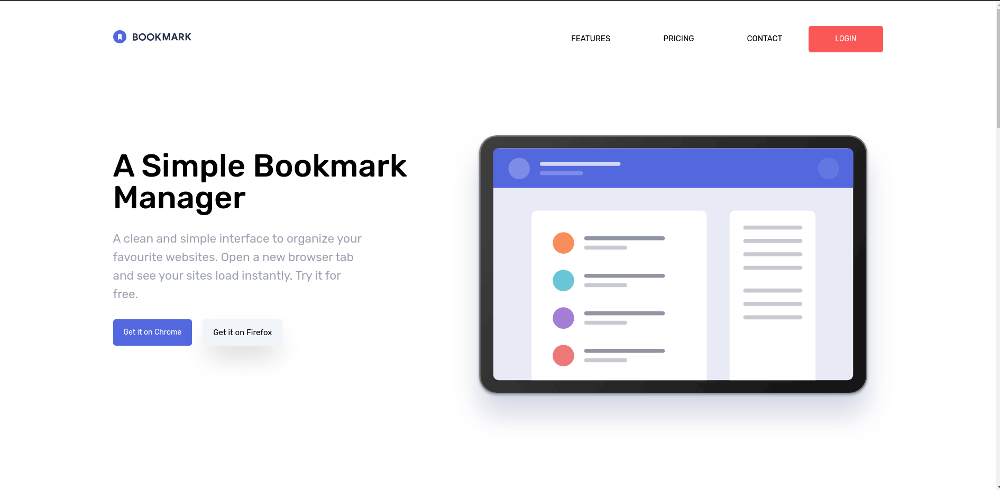

# Bookmark landing Page

This is a solution to the [Bookmark landing page challenge on Frontend Mentor](https://www.frontendmentor.io/challenges/bookmark-landing-page-5d0b588a9edda32581d29158). 

### Screenshot

### Links

- Live Link: [Bookmark Landing Page](https://francis-bookmark-landing-page.netlify.app/#)

### Built with

- React
- Tailwind CSS
- TypeScript

## Available Scripts

In the project directory, you can run:

### `yarn install`

Install the packages and dependencies
### `yarn run dev`

Runs the app in the development mode. 
Open [http://localhost:3000](http://localhost:3000) to view it in the browser.

The page will reload if you make edits. 
You will also see any lint errors in the console.

## Author

- Website - [Francis shonubi](https://github.com/olad5)
- Twitter - [@_olad5](https://www.twitter.com/olad5)

